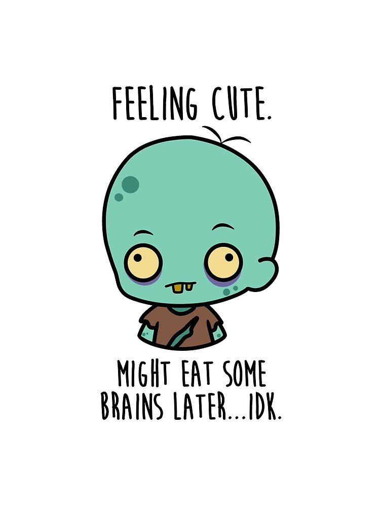

## Set up 

```{r setup, include=FALSE}
knitr::opts_chunk$set(echo = TRUE)
```

```{r}
#download the new package ggpubr first
#install.packages("ggpubr") for Q-Q plots

#loading ggplot for the figures
library(ggplot2)
library(dplyr)
library(ggpubr)
```

```{r}
#loading prettydoc for the theme
#library(prettydoc)
```

## Favorite picture related to zombies that I was able to find online (credit to reddit)

{width="300"}
#Comment: So sorry for the late comments. I hope you figured it out. I struggled with my time management for this homework and it took longer than expected. It was also my fault, I didn't see your message on slack! Thank you for bringing it to my attention, I will be more communicative in future projects. 

## 5 Challenges I have faced

1.  **Communication with Group Members**: I had a hard time coordinating with my groupmates because they were unresponsive to my Slack messages and emails. This made it difficult to clarify questions and ensure we were all on the same page. One group member finally sent me her repository, but it was late Sunday night, leaving me little time to review her work or provide meaningful feedback. This last-minute sharing also made it harder to incorporate any potential revisions before the deadline.
2.  **Understanding Factors vs. Data Frames:** One of the biggest technical challenges I faced was knowing when to convert factors into numerical values for analysis. At times, I didn’t realize that a variable was stored as a factor, which led to errors when trying to perform calculations. Other times, I converted a factor into numbers but didn't check whether R had assigned meaningful numerical values or just default categorical codes. This made me second-guess how I was handling data and whether I was processing it correctly for statistical analysis.
3.  **Difficulty Finding Information from Previous Modules:** Since this assignment required integrating multiple concepts we’ve covered in previous modules, I found myself constantly going back to old notes and materials. However, I wasted a lot of time searching for specific details because I didn’t have an organized way to reference them. I realized that I need to create a dedicated document that summarizes key functions, common troubleshooting solutions, and essential concepts from each module. Having a centralized resource would make reviewing past material much more efficient and help me work through assignments faster.
4.  **Increased Errors and Self-Doubt in Coding:** Compared to previous assignments, I found myself getting stuck much more frequently. Small errors, like typos or forgetting a specific function syntax, caused frustrating error messages that were difficult to debug on my own. Since this assignment involved statistical concepts on top of R coding, I struggled to piece together different elements correctly. The frequent setbacks made me doubt my ability to code effectively, and I found myself questioning whether I was really improving in R. The fact that stats build upon so many previous modules made troubleshooting even harder, as a mistake from an earlier step could throw off the entire analysis.
5.  **Time Management and Workflow Balance:** Last time, I decided to finish all the modules before starting the homework, thinking it would help me troubleshoot less on my own. However, this time, I spent so much time working through the modules that I didn’t leave myself enough time to complete the assignment properly. I felt rushed while finishing the homework and didn’t have enough time to double-check my work or debug issues carefully. I need to adjust my time allocation so that I can still review the modules while ensuring I have enough time to apply the concepts and complete the assignment at a comfortable pace.

## Load zombie. csv

```{r}
#loading the initial zombie csv from prof. schimt's repo
zombie <- read.csv("/Users/sherryxie/CODE/Github/repos/Homework/Sherry's Homework 03/zombies.csv")

#trying to visually understanding the data before I do anything to it 
str(zombie)
```

## 1. Population mean and standard deviation ERROR
#Comment: Maybe the error message was due to x and mu not being defined in the standard deviation formula? 
```{r}
# Function for population mean and standard deviation since we can not use build in sd and var
#population_stats <- function(zombie) {
  #mean <- mean(zombie, na.rm = TRUE)       # Population mean from the zombie csv
  #sd <- sqrt(sum((x - mu)^2) / length(x))  # Population standard deviation (N, not N-1)
  #return(c(Mean = mean, SD = sd))
#}

# Select relevant quantitative variables
#quantitative_variables <- zombie %>% select(height, weight, age, zombies_killed, years_of_education)

# Apply the function to each quantitative column listed in hw instruction
# ERROR MESSAGE HERE
#population_stats_results <- sapply(quantitative_variables, population_stats)

#print(population_stats_results)
```

## 2. Boxplot for each quantitative variable by gender
#Comment: This is a very organized way to solve the problem! 
```{r}
# Convert gender to a factor just in case it is not already 
zombie$gender <- as.factor(zombie$gender)

# Boxplot for each quantitative variable by gender
ggplot(zombie, aes(x = gender, y = height)) + geom_boxplot() + theme_minimal()
ggplot(zombie, aes(x = gender, y = weight)) + geom_boxplot() + theme_minimal()
ggplot(zombie, aes(x = gender, y = age)) + geom_boxplot() + theme_minimal()
ggplot(zombie, aes(x = gender, y = zombies_killed)) + geom_boxplot() + theme_minimal()
ggplot(zombie, aes(x = gender, y = years_of_education)) + geom_boxplot() + theme_minimal()

```

## 3. Scatterplots of height and weight in relation to age

From the two plots, I think the two variables height and weight are related because the line of best fit from both scatter plots are linearly upward trend.
#Comment: The answer was well explained and detailed!! 
```{r}
#age vs height scatterplot
# I added in a line of best fit to better help me see if the two terms are related with each other 
ggplot(zombie, aes(x = age, y = height)) + geom_point() + geom_smooth(method = "lm") + theme_minimal()

#age vs weight scatterplot
# I added in a line of best fit to better help me see if the two terms are related with each other 
ggplot(zombie, aes(x = age, y = weight)) + geom_point() + geom_smooth(method = "lm") + theme_minimal()
```

## 4. Histograms and Q-Q plots
#Comment: The function normal_distribution_check() is well structure! maybe also include na.rm= TRUE in hist() and qqnorm()
-   From the histogram and qqplot comparison below, height, weight, and age are drawn from the normal distribution

-   From the histogram and qqplot comparison below zombies killed and years of education are **NOT** drawn from the normal distribution

    -   I think specifically zombies killed and years of education are drawn from Poisson distribution because they are skewed to the left and their qqplot does not follow the linear diagonal line

```{r}
# Function to plot histogram & Q-Q plot so I do not have to write it out for each of the variables
normal_distribution_check <- function(variable, name) {
  par(mfrow = c(1, 2))  # Side-by-side plots histogram vs pplot comparision
  hist(variable, main = paste("Histogram of", name), col = "lightblue", probability = TRUE) #histogram view
  qqnorm(variable, main = paste("Q-Q Plot of", name)) #qqplot view
  qqline(variable, col = "red")                       #qqplot linear diagonal line
}

# Apply to each variable
normal_distribution_check(zombie$height, "Height")        #height comparision
normal_distribution_check(zombie$weight, "Weight")       #weight comparision
normal_distribution_check(zombie$age, "Age")             #age comparision
normal_distribution_check(zombie$zombies_killed, "Zombies Killed")       #zombies killed comparision
normal_distribution_check(zombie$years_of_education, "Years of Education")   #years of education comparision

```

## 5. Pt:1 Random Sample of 30 & Calculate Summary Statistics

```{r}
set.seed(100)  # For reproducibility

# Sample 30 survivors without replacement
sample_30 <- zombie %>% sample_n(30)

# Compute sample mean, sample SD, and standard error
#I used the built in version compared to question one because no we are looking at a sample
sample_stats <- sample_30 %>% summarise(
  Mean_Height = mean(height, na.rm = TRUE),
  SD_Height = sd(height, na.rm = TRUE),
  SE_Height = SD_Height / sqrt(30),

  Mean_Weight = mean(weight, na.rm = TRUE),
  SD_Weight = sd(weight, na.rm = TRUE),
  SE_Weight = SD_Weight / sqrt(30),

  Mean_Age = mean(age, na.rm = TRUE),
  SD_Age = sd(age, na.rm = TRUE),
  SE_Age = SD_Age / sqrt(30),

  Mean_ZombiesKilled = mean(zombies_killed, na.rm = TRUE),
  SD_ZombiesKilled = sd(zombies_killed, na.rm = TRUE),
  SE_ZombiesKilled = SD_ZombiesKilled / sqrt(30),

  Mean_Education = mean(years_of_education, na.rm = TRUE),
  SD_Education = sd(years_of_education, na.rm = TRUE),
  SE_Education = SD_Education / sqrt(30)
)

print(sample_stats)

```

## 5. Pt 2: 95% CI

```{r}
# Function to calculate 95% Confidence Interval
calc_CI <- function(mean, se, n) {
  error_margin <- qt(0.975, df = n - 1) * se
  lower <- mean - error_margin
  upper <- mean + error_margin
  return(c(lower, upper))  # Returns a vector of length 2
}

#Listing out the CI for all the variables
sample_stats <- sample_stats %>%
  mutate(
    CI_Height_Lower = Mean_Height - qt(0.975, df = 30-1) * SE_Height,
    CI_Height_Upper = Mean_Height + qt(0.975, df = 30-1) * SE_Height,
    CI_Weight_Lower = Mean_Weight - qt(0.975, df = 30-1) * SE_Weight,
    CI_Weight_Upper = Mean_Weight + qt(0.975, df = 30-1) * SE_Weight,
    CI_Age_Lower = Mean_Age - qt(0.975, df = 30-1) * SE_Age,
    CI_Age_Upper = Mean_Age + qt(0.975, df = 30-1) * SE_Age
  )

# Print results
print(sample_stats)

```

## 6. Pt 1: Generate 99 More Samples (Total 100) & Calculate Sampling Distribution

Comparison of standard deviation to standard error in part 5. The SD and SE for each of the variables still seem pretty similar, for example. SD for age = 0.47, SE for age = 0/495. There is no set of value that is suddenly drastically different from each other.
#This code is great and easy to follow! 
```{r}
set.seed(100) #set for reproducibility 

# Function to sample and compute means
sample_means <- function() {
  sample_100 <- zombie %>% sample_n(30)
  return(c(
    mean(sample_100$height, na.rm = TRUE),
    mean(sample_100$weight, na.rm = TRUE),
    mean(sample_100$age, na.rm = TRUE),
    mean(sample_100$zombies_killed, na.rm = TRUE),
    mean(sample_100$years_of_education, na.rm = TRUE)
  ))
}

# Repeat 99 times
sampling_99 <- replicate(99, sample_means())

# Convert to data frame
sampling_df <- as.data.frame(t(sampling_99))
colnames(sampling_df) <- c("Height", "Weight", "Age", "ZombiesKilled", "YearsEducation")

# Calculate mean & SD of sampling distribution
sampling_summary <- sampling_df %>% summarise_all(list(Mean = mean, SD = sd))
print(sampling_summary)

```

## 6. Pt:2 Normally distributed visualization
#Great work for plotting the histograms and visualizing their shape! You also confirmed whether the sampling distribution appeared normal- which answered the question! Maybe you could clarity the comparison between SD of sampling distribution from SE 5. 
Now that is has been 100 samples, it seems like all the variables from the histogram visualization are all normally distributed. Even zombies killed and years of education that were originally not normally distributed.

```{r}
# Histograms for sampling distributions
ggplot(sampling_df, aes(x = Height)) + geom_histogram(binwidth = 0.5, fill = "lightblue", color = "black") + theme_minimal()
ggplot(sampling_df, aes(x = Weight)) + geom_histogram(binwidth = 1, fill = "lightblue", color = "black") + theme_minimal()
ggplot(sampling_df, aes(x = Age)) + geom_histogram(binwidth = 1, fill = "lightblue", color = "black") + theme_minimal()
ggplot(sampling_df, aes(x = ZombiesKilled)) + geom_histogram(binwidth = 1, fill = "lightblue", color = "black") + theme_minimal()
ggplot(sampling_df, aes(x = YearsEducation)) + geom_histogram(binwidth = 1, fill = "lightblue", color = "black") + theme_minimal()
```
